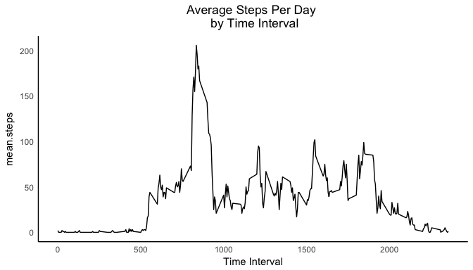

# Reproducible Research: Peer Assessment 1
[Spencer Castro](http://spencercastro.com)  
12/18/2016  


# -Loading and preprocessing the data
***
First we'll set the working directory and load the <b>activity.csv</b> file.
1. Load the data (i.e. read.csv())

```r
setwd('~/Documents/RepData_PeerAssessment1')
activity <- read.csv("activity.csv", header=TRUE)
```
2. Process/transform the data (if necessary) into a format suitable for your analysis
<ul>  
<li>Convert the character date column to a lubridate date in YYYY-MM-DD format.</li>  
</ul>

```r
# Change the interval column to a Date in a new column "time"
activity <- activity %>%
  mutate(date = ymd(date))
```
Here's the structure of the data after preprocessing:

```r
head(activity)
```

```
##   steps       date interval
## 1    NA 2012-10-01        0
## 2    NA 2012-10-01        5
## 3    NA 2012-10-01       10
## 4    NA 2012-10-01       15
## 5    NA 2012-10-01       20
## 6    NA 2012-10-01       25
```

```r
str(activity)
```

```
## 'data.frame':	17568 obs. of  3 variables:
##  $ steps   : int  NA NA NA NA NA NA NA NA NA NA ...
##  $ date    : Date, format: "2012-10-01" "2012-10-01" ...
##  $ interval: int  0 5 10 15 20 25 30 35 40 45 ...
```

***

# -What is mean total number of steps taken per day?
***
For this part of the assignment, you can ignore the missing values in the dataset.
1. Make a histogram of the total number of steps taken each day
2. Calculate and report the <b>mean</b> and <b>median</b> total number of steps taken per day
In order to find the mean number of steps by day, we will create the dataframe <b>avg_steps</b> with colums <b>date</b> and <b>steps</b>  

```r
avg_steps <- activity %>%
  group_by(date) %>%
  summarize(total_steps = sum(steps))
```
The histograms below visualize the distribution of total steps (frequency and density).

```r
# frequencies
fplot <- ggplot(avg_steps, aes(total_steps)) + 
  geom_histogram(breaks = seq(0,21194, by = 1000), fill = "black", alpha=.6, col = "black") +
  my.axis.font + theme_minimal() +
  labs(title = "Total Steps Per Day") + xlab("Daily Steps") + 
     theme(plot.title = element_text(hjust = 0.5)) + my.theme

# desnsity
dplot <- ggplot(avg_steps, aes(total_steps)) + 
  geom_density() + my.axis.font + theme_minimal() +
  labs(title = "Total Steps Per Day") + xlab("Daily Steps") + 
     theme(plot.title = element_text(hjust = 0.5)) + my.theme

ggplot2.multiplot(fplot,dplot, cols=2)
```


Finally, we'll calculate the mean and median number of steps per day.  

```r
mean(avg_steps$total_steps,na.rm = T)
```

```
## [1] 10766.19
```

```r
median(avg_steps$total_steps,na.rm=T)
```

```
## [1] 10765
```

***

# -What is the average daily activity pattern?
***
1. Make a time series plot (i.e. type = "l") of the 5-minute interval (x-axis) and the average number of steps taken, averaged across all days (y-axis)

2. Which 5-minute interval, on average across all the days in the dataset, contains the maximum number of steps?
First we'll use the dplyr's summarize function to get the average number of steps for each time interval.  Then we'll can draw a time series plot showing time interval on the x-axis and mean number of steps for the time interval on the y-axis.   

```r
par(mfrow = c(1,1))
avg_steps_by_time <- activity %>%
  na.omit() %>%
  group_by(interval) %>%
  summarize(mean.steps = mean(steps, na.rm = T), med.steps = median(steps, na.rm = T)) %>%
  mutate(mean.steps = round(mean.steps), med.steps = round(med.steps))

aplot <- ggplot(avg_steps_by_time, aes(x = interval, y = mean.steps)) + 
  geom_line() + my.axis.font + theme_minimal() +
  labs(title = "Average Steps Per Day \n by Time Interval") + xlab("Time Interval") + 
     theme(plot.title = element_text(hjust = 0.5)) + my.theme
aplot
```



Next, we determine the time interval with the maximum average number of steps.  

```r
avg_steps_by_time %>%
  filter(mean.steps == max(mean.steps))
```

```
## # A tibble: 1 × 3
##   interval mean.steps med.steps
##      <int>      <dbl>     <dbl>
## 1      835        206        19
```
The time interval with the maximum number of steps in a day on average is 835.

***

# -Imputing missing values
***
1. Calculate and report the total number of missing values in the dataset (i.e. the total number of rows with NAs)
2. Devise a strategy for filling in all of the missing values in the dataset. The strategy does not need to be sophisticated. For example, you could use the mean/median for that day, or the mean for that 5-minute interval, etc.
3. Create a new dataset that is equal to the original dataset but with the missing data filled in.
4. Make a histogram of the total number of steps taken each day and Calculate and report the mean and median total number of steps taken per day. Do these values differ from the estimates from the first part of the assignment? What is the impact of imputing missing data on the estimates of the total daily number of steps?
First, obtain a count of missing values in the steps column.  

```r
activity %>%
  summarise(na_in_steps = sum(is.na(steps)))
```

```
##   na_in_steps
## 1        2304
```
We'll use the mean steps for the time interval for an imputed value.  First, we'll need to join the <b>activity</b> data frame with <b>avg_steps_by_time</b> data frame to make a new one called <b>imp_act</b>.  We'll impute values for the NA's in the new data frame.  

```r
# "join" the two data frames using inner_join()
imp_act <-inner_join(activity,avg_steps_by_time,by="interval")
# correct the NA steps with average steps for the interval
imp_act1 <- imp_act %>%
  mutate(steps = ifelse(is.na(imp_act$steps),
                  imp_act$mean.steps,
                  imp_act$steps))
```
Now we can recalculate steps per day:

```r
avg_steps_imp <- imp_act1 %>%
  group_by(date) %>%
  summarize(total_steps = sum(steps))
```
and show histograms of total steps (frequency and density).

```r
par(mfrow=c(1,1))
fplot2 <- ggplot(avg_steps_imp, aes(total_steps)) + 
  geom_histogram(breaks = seq(0,21194, by = 1000), fill = "black", alpha=.6, col = "black") +
  my.axis.font + theme_minimal() +
  labs(title = "Total Steps Per Day") + xlab("Daily Steps") + 
     theme(plot.title = element_text(hjust = 0.5)) + my.theme

# desnsity
dplot2 <- ggplot(avg_steps_imp, aes(total_steps)) + 
  geom_density() + my.axis.font + theme_minimal() +
  labs(title = "Total Steps Per Day") + xlab("Daily Steps") + 
     theme(plot.title = element_text(hjust = 0.5)) + my.theme


ggplot2.multiplot(fplot2,dplot2, cols=2)
```


Finally, we'll calculate the mean and median number of steps per day.  

```r
mean(avg_steps_imp$total_steps)
```

```
## [1] 10765.64
```

```r
median(avg_steps_imp$total_steps)
```

```
## [1] 10762
```
The new mean is 10765.64 and the new media is 10762. 

***
# -Are there differences in activity patterns between weekdays and weekends?
***
1. Create a new factor variable in the dataset with two levels -- "weekday" and "weekend" indicating whether a given date is a weekday or weekend day.

2. Make a panel plot containing a time series plot (i.e. type = "l") of the 5-minute interval (x-axis) and the average number of steps taken, averaged across all weekday days or weekend days (y-axis). The plot should look something like the following, which was created using simulated data:

```r
weeklist <- list("Monday","Tuesday","Wednesday","Thursday","Friday")
imp_act1$day <- weekdays(as.Date(imp_act1$date))
imp_act1$day <- factor(imp_act1$day)
imp_act1$week <- ifelse(imp_act1$day %in% weeklist, "week","weekend")
imp_act1$week <- factor(imp_act1$week)
```
Now draw a panel plot using ggplot2, comparing activity patterns on weekdays and weekends.

```r
avg_week_steps <- imp_act1 %>%
  group_by(interval,week) %>%
  summarize(mean.steps.week = mean(steps))

aplot2 <- ggplot(avg_week_steps, aes(x = interval, y = mean.steps.week)) + 
  geom_line() + facet_grid(week~.) + my.axis.font + theme_minimal() +
  labs(title = "Average Steps Per Day \n by Time Interval \n on the Week and Weekend") + xlab("Time Interval") + 
     theme(plot.title = element_text(hjust = 0.5)) + my.theme
aplot2
```


***
