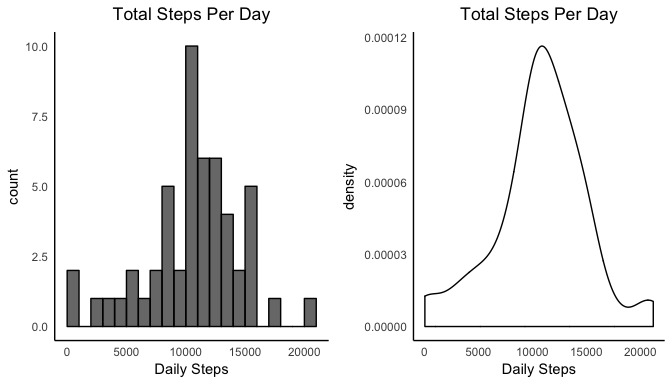
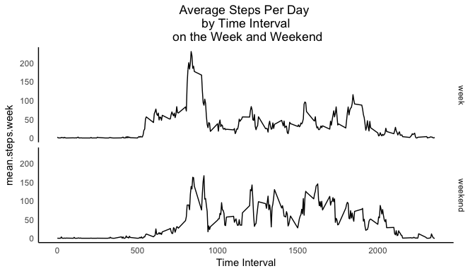

# Reproducible Research: Peer Assessment 1
[Spencer Castro](http://spencercastro.com)  
12/18/2016  


# -Loading and preprocessing the data
***
First we'll set the working directory and load the <b>activity.csv</b> file.    

```r
setwd('~/Documents/RepData_PeerAssessment1')
activity <- read.csv("activity.csv", header=TRUE)
```

We will pre-process the file as follows:  
1. Convert the character date column to a POSIX date in YYYY-MM-DD format.  
2. Convert the integer interval column to a new POSIX time column in HH:MM:SS format.  

```r
# convert character date to POSIX date
activity$date <- as.POSIXct(strptime(activity$date, "%Y-%m-%d"),tz="")
# first convert integer time to character and pad with leading zeros...
activity$time     <- sprintf("%04d", activity$interval)#C style language, fill in leading zeros
# ...then convert to the date type
activity$time     <- as.POSIXct(activity$time, "%H%M",tz="")
```

Let's display some of the data and the structure of the data frame after pre-processing.

```r
head(activity)
```

```
##   steps       date interval                time
## 1    NA 2012-10-01        0 2016-12-19 00:00:00
## 2    NA 2012-10-01        5 2016-12-19 00:05:00
## 3    NA 2012-10-01       10 2016-12-19 00:10:00
## 4    NA 2012-10-01       15 2016-12-19 00:15:00
## 5    NA 2012-10-01       20 2016-12-19 00:20:00
## 6    NA 2012-10-01       25 2016-12-19 00:25:00
```

```r
str(activity)
```

```
## 'data.frame':	17568 obs. of  4 variables:
##  $ steps   : int  NA NA NA NA NA NA NA NA NA NA ...
##  $ date    : POSIXct, format: "2012-10-01" "2012-10-01" ...
##  $ interval: int  0 5 10 15 20 25 30 35 40 45 ...
##  $ time    : POSIXct, format: "2016-12-19 00:00:00" "2016-12-19 00:05:00" ...
```
***
# -What is mean total number of steps taken per day?
===
To answer this question, we'll use aggregate() to create a new data frame.  The data frame will contain two columns:  
1. date; and  
2. total steps for each date.  
We will ignore the missing values in the data set.  

```r
total_steps_by_date <- aggregate(list(total_steps = activity$steps),
                                 by=list(date = activity$date),
                                 FUN=sum,
                                 na.rm=TRUE)
```
The histograms below show the distribution of total steps (frequency and density).

```r
# In order to avoid waring of Hebrew characters occurs, 
# use windows() function to set width and height in advance
options(device = function(file, width = 7, height = 7, ...) {
windows(width = width, height = height, ...)
 })

par(mfrow=c(1,2))# 1 row, 2 columns
# frequencies
hist(total_steps_by_date$total_steps,
     breaks=30,
     xlab="Total Steps",
     main="Total Steps Per Day",
     col="lightblue")
# desnsity
plot(density(total_steps_by_date$total_steps,
             na.rm=TRUE),
     xlab="Total Steps",
     ylab="Density",
     main="Total Steps Per Day",     
     col="purple",
     lwd=3)
```



```r
par(mfrow=c(1,1))
```
Finally, we'll calculate the mean and median number of steps per day.  

```r
mean(total_steps_by_date$total_steps)
```

```
## [1] 9354.23
```

```r
median(total_steps_by_date$total_steps,na.rm=T)
```

```
## [1] 10395
```
***
# -What is the average daily activity pattern?
***
First we'll use the aggregate() function to obtain the average number of steps for each time interval.  With the result, we can draw a time series plot showing time interval on the x-axis and mean number of steps for the time interval on the y-axis.   

```r
average_steps_by_time <- aggregate(list(average_steps = activity$steps),
                                   by=list(time = activity$time,
                                           interval = activity$interval),
                                   FUN=mean,
                                   na.rm=TRUE)
plot(average_steps ~ time,
     data=average_steps_by_time,
     xlab="Time interval",
     ylab="Mean steps",
     main="Mean Steps By Time Interval",
     type="l",
     col="blue",
     lwd=2)
```


Next, we determine the time interval with the maximum average number of steps.  

```r
average_steps_by_time[which.max(average_steps_by_time$average_steps),]
```

```
##                    time interval average_steps
## 104 2016-12-19 08:35:00      835      206.1698
```
***
# -Imputing missing values
***
First, obtain a count of missing values in the steps column.  

```r
sum(is.na(activity[,"steps"]))
```

```
## [1] 2304
```
For an imputed value, use the average number of steps for the time interval, obtained above.  To do this, we'll merge the original data frame with the data frame containing average steps by interval to form a third, new data frame.  We'll impute values for the NA's in the new data frame.  

```r
# "join" the two data frames using merge()
activity_imputed <- merge(activity,average_steps_by_time,by="interval")
# correct the NA steps with average steps for the interval
activity_imputed <- within(activity_imputed,
                           steps <- ifelse(is.na(activity_imputed$steps),
                           activity_imputed$average_steps,
                           activity_imputed$steps))
```
Now calculate the total number of steps per day with the imputed values.

```r
total_steps_by_date_imputed <- aggregate(list(total_steps = activity_imputed$steps),
                                         by=list(date = activity_imputed$date),
                                         FUN=sum,
                                         na.rm=FALSE)
```
Draw histograms showing the distribution of total steps (frequency and density) with the imputed values.

```r
par(mfrow=c(1,2))
# frequencies
hist(total_steps_by_date_imputed$total_steps,
     breaks=30,
     xlab="Total Steps",
     main="Total Steps Per Day",
     col="lightblue")
# desnsity
plot(density(total_steps_by_date_imputed$total_steps,
             na.rm=TRUE),
     xlab="Total Steps",
     ylab="Density",
     main="Total Steps Per Day",     
     col="purple",
     lwd=3)
```


```r
par(mfrow=c(1,1))
```
Finally, we'll calculate the mean and median number of steps per day.  

```r
mean(total_steps_by_date_imputed$total_steps)
```

```
## [1] 10766.19
```

```r
median(total_steps_by_date_imputed$total_steps)
```

```
## [1] 10766.19
```
The mean and median total number of steps are now equal to one another (!!!) and higher with the imputed values.  Estimates of the total daily number of steps are higher with the imputed values.  

***
# -Are there differences in activity patterns between weekdays and weekends?
***
Add a factor called weekend_indicator with two levels to the data set indicating whether the date is a weekday or a weekend.

```r
# first add a character column for day of the week
activity_imputed$weekday  <- weekdays(activity_imputed$date)
# now populate a new factor column using day of the week and a simple function
activity_imputed$weekend_indicator <- as.factor(apply(activity_imputed["weekday"], 1, function(x) {
  switch(x,
         "Sunday" = "weekend",
         "Saturday" = "weekend",
         "weekday")
}))
# confirm that we have the character and factor types we expect
str(activity_imputed)
```

```
## 'data.frame':	17568 obs. of  8 variables:
##  $ interval         : int  0 0 0 0 0 0 0 0 0 0 ...
##  $ steps            : num  1.72 0 0 0 0 ...
##  $ date             : POSIXct, format: "2012-10-01" "2012-11-23" ...
##  $ time.x           : POSIXct, format: "2016-12-19 00:00:00" "2016-12-19 00:00:00" ...
##  $ time.y           : POSIXct, format: "2016-12-19 00:00:00" "2016-12-19 00:00:00" ...
##  $ average_steps    : num  1.72 1.72 1.72 1.72 1.72 ...
##  $ weekday          : chr  "Monday" "Friday" "Sunday" "Tuesday" ...
##  $ weekend_indicator: Factor w/ 2 levels "weekday","weekend": 1 1 2 1 2 1 2 1 1 2 ...
```
Now draw a panel plot using ggplot2, comparing activity patterns on weekdays and weekends.

```r
average_steps_by_time_weekend <- aggregate(list(average_steps = activity_imputed$steps),
                                           by=list(time       = activity_imputed$time.x,
                                                   daytype    = activity_imputed$weekend_indicator),
                                           FUN=mean)
library(ggplot2)
qplot(x = time,
      y = average_steps,
      geom="path",
      data = average_steps_by_time_weekend, 
      xlab="Time interval",
      ylab="Average steps",
      main="Activity Patterns\nWeekdays vs. Weekends",
      facets = daytype ~ .)
```



The histograms will be a little easier to interpret if accompanied by summary statistics, broken out by weekday / weekend.  On average, steps are higher on the weekend, although the maximum for steps is highest on weekday mornings at 8:35.  Weekend activity is more variable (s.d. of steps is higher on the weekend).     

```r
library(psych)
by(average_steps_by_time_weekend,
   average_steps_by_time_weekend$daytype,
   FUN=describe)
```

```
## average_steps_by_time_weekend$daytype: weekday
##               vars   n  mean    sd median trimmed   mad min    max  range
## time*            1 288   NaN    NA     NA     NaN    NA Inf   -Inf   -Inf
## daytype*         2 288  1.00  0.00    1.0    1.00  0.00   1   1.00   0.00
## average_steps    3 288 35.61 41.62   25.8   28.33 35.23   0 230.38 230.38
##               skew kurtosis   se
## time*           NA       NA   NA
## daytype*       NaN      NaN 0.00
## average_steps 2.09     5.49 2.45
## -------------------------------------------------------- 
## average_steps_by_time_weekend$daytype: weekend
##               vars   n  mean    sd median trimmed   mad min    max  range
## time*            1 288   NaN    NA     NA     NaN    NA Inf   -Inf   -Inf
## daytype*         2 288  2.00  0.00   2.00    2.00  0.00   2   2.00   0.00
## average_steps    3 288 42.37 42.54  32.34   37.11 46.91   0 166.64 166.64
##               skew kurtosis   se
## time*           NA       NA   NA
## daytype*       NaN      NaN 0.00
## average_steps 0.79    -0.34 2.51
```
***
